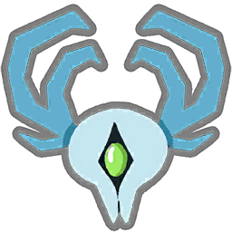

# 仪式兽 / Ceremonial Beast

[English](README.md) | [简体中文](README.zh-CN.md)



仪式兽是《杀戮尖塔 2》的非官方可玩角色 Mod。它将游戏中的仪式兽怪物改造为完整角色，玩法围绕仪式节奏、属性转换与卡牌附魔展开。

项目目前仍处于早期开发阶段。随着游戏更新，平衡性、本地化和兼容性可能继续调整。

## 内容特色

- 完整的可玩角色，复用原版仪式兽的场景、动画和音效。
- **91 项卡牌内容**，包括初始牌、衍生牌、先古牌与联机牌。
- **10 件遗物**、**3 瓶药水**和**4 种自定义附魔**。
- 完整的英文与简体中文本地化。
- 支持联机环境的卡牌效果与战斗 Hook。

## 核心机制

- **Plow**：在回合开始时获得临时力量，同时失去等量临时敏捷；受到未被格挡的伤害时会失去 Plow。
- **Ringing**：暂时阻止常规出牌。许多卡牌会进入、移除或要求处于 Ringing，使它成为需要规划时机的资源。
- **附魔**：通过赐福、启迪、耕耘和积蓄，为卡牌添加本场战斗或永久生效的额外效果。

## 环境要求

### 游玩

- 已启用 Mod 支持的《杀戮尖塔 2》。
- [BaseLib-StS2](https://github.com/Alchyr/BaseLib-StS2) 3.4.5 或更高版本。

## 安装方法

1. 将 BaseLib 安装到 `<Slay the Spire 2>/mods/BaseLib/`。
2. 下载并解压仪式兽 Mod 的 Release 压缩包。
3. 将解压后的完整文件夹放入游戏的 `mods` 目录。

最终目录结构应为：

```text
Slay the Spire 2/
└── mods/
    ├── BaseLib/
    │   ├── BaseLib.dll
    │   ├── BaseLib.json
    │   └── BaseLib.pck
    └── CeremonialBeast/
        ├── CeremonialBeast.dll
        ├── CeremonialBeast.json
        └── CeremonialBeast.pck
```

联机时，所有玩家应使用相同版本的 Mod 和依赖。

## 从源码构建

克隆仓库并进入项目根目录：

```powershell
git clone <repository-url>
cd CeremonialBeast
```

项目会自动查找 Steam 默认安装目录。如果游戏或 MegaDot 位于其他位置，请创建本地配置：

```powershell
Copy-Item Directory.Build.props.example Directory.Build.props
```

修改 `Directory.Build.props` 后编译 C# 项目：

```powershell
dotnet build CeremonialBeast.csproj -c Release
```

导出 Godot 资源并生成 `CeremonialBeast.pck`：

```powershell
dotnet publish CeremonialBeast.csproj -c Release
```

项目会将构建结果复制到 `<Slay the Spire 2>/mods/CeremonialBeast/`。

生成干净的 GitHub Release 安装包、校验文件及版本标签的完整步骤见 [docs/RELEASING.md](docs/RELEASING.md)。玩家安装包只包含 DLL、PCK 和 Mod 清单。

## 项目结构

| 路径 | 用途 |
| --- | --- |
| `CeremonialBeastCode/` | 角色、卡牌、能力、遗物、药水、附魔及管理器的 C# 代码 |
| `CeremonialBeast/` | Godot 资源、美术、UI 与本地化文件 |
| `CeremonialBeast/localization/eng/` | 英文本地化 |
| `CeremonialBeast/localization/zhs/` | 简体中文本地化 |
| `CeremonialBeast.json` | Mod 清单 |
| `Sts2PathDiscovery.props` | 跨平台游戏路径查找 |
| `Directory.Build.props.example` | 可选的本地路径配置模板 |

源码布局参考了 [BaseLib 角色模板](https://github.com/Alchyr/ModTemplate-StS2) 以及其他开源《杀戮尖塔 2》角色 Mod 的通用结构。

## 兼容性说明

《杀戮尖塔 2》仍在持续更新，游戏升级可能修改 C# Hook 或方法签名。请使用当前已安装游戏中的 `sts2.dll` 构建本项目。如果 Mod 无法加载，请优先检查《杀戮尖塔 2》用户数据目录下的最新游戏日志。

## 鸣谢与免责声明

- [Mega Crit](https://www.megacrit.com/)：开发《杀戮尖塔 2》并创作原版仪式兽资产。
- [Alchyr/BaseLib-StS2](https://github.com/Alchyr/BaseLib-StS2)：提供内容框架与自定义角色支持。
- 《杀戮尖塔 2》Mod 社区及相关开源模板。

本项目是非商业同人作品，与 Mega Crit 不存在隶属或官方合作关系。《杀戮尖塔 2》及其原版资产的权利归相应权利方所有。
